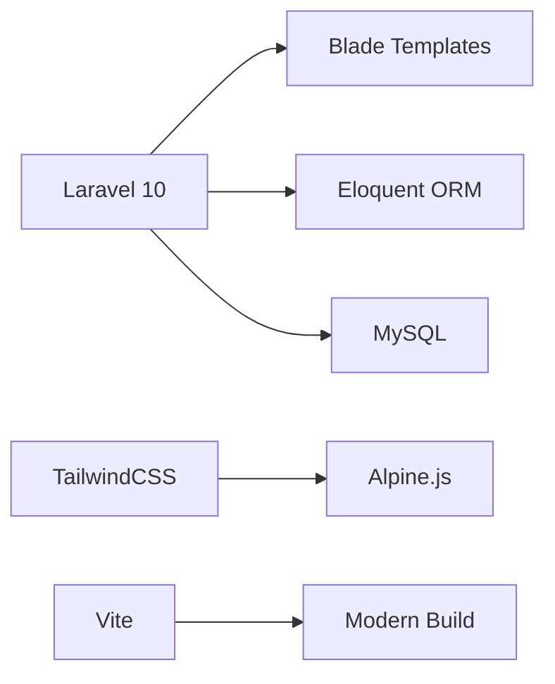

<div align="center">

# 🏢 İzokoç İzolasyon - İçerik Yönetim Sistemi

### Laravel Tabanlı Kurumsal CMS Çözümü

[](https://laravel.com)
[](https://php.net)
[](LICENSE)

[Demo](#) • [Dokümantasyon](#) • [İletişim](#)

</div>

---

## 📋 İçindekiler

- [Proje Hakkında](#-proje-hakkında)
- [İzokoç İzolasyon](#-izokoç-izolasyon-hakkında)
- [Özellikler](#-temel-özellikler)
- [Teknolojiler](#-kullanılan-teknolojiler)
- [Kurulum](#-kurulum)
- [Mimari](#-sistem-mimarisi)
- [Ekran Görüntüleri](#-ekran-görüntüleri)

---

## 🎯 Proje Hakkında

Bu proje, **İzokoç İzolasyon** firmasının kurumsal web sitesini yönetmek için özel olarak geliştirilmiş, modern ve esnek bir **Laravel tabanlı CMS**'dir.

### ✨ Neden Bu CMS?

- 🚀 **Sıfır Kod ile İçerik Yönetimi** - Teknik bilgi gerektirmez
- 🎨 **Modüler Sayfa Oluşturucu** - Drag & drop mantığı
- 📱 **Responsive Tasarım** - Tüm cihazlarda uyumlu
- ⚡ **Yüksek Performans** - Optimize edilmiş kod yapısı
- 🔒 **Güvenli** - Laravel security best practices

---

## 🏭 İzokoç İzolasyon Hakkında

> **İzokoç İzolasyon**, endüstriyel tesisler ve mekanik tesisatlar için yüksek performanslı yalıtım çözümleri sunan lider bir mühendislik ve taahhüt firmasıdır.

**Misyonumuz:**
- ⚡ Enerji verimliliğini artırmak
- 🛡️ İşletme güvenliğini sağlamak
- 🌱 Çevresel etkiyi azaltmak

---

## 🚀 Temel Özellikler

<table>
<tr>
<td width="50%">

### 📄 İçerik Yönetimi
- ✅ Dinamik sayfa oluşturucu
- ✅ Modüler bölüm yapısı
- ✅ SEO optimizasyonu
- ✅ Meta tag yönetimi
- ✅ Open Graph desteği

</td>
<td width="50%">

### 🎨 Görsel Yönetim
- ✅ Slider yönetimi
- ✅ Medya kütüphanesi
- ✅ Görsel optimizasyonu
- ✅ Galeri sistemi
- ✅ Banner yönetimi

</td>
</tr>
<tr>
<td width="50%">

### 📰 Blog & İçerik
- ✅ Blog sistemi
- ✅ Kategori & etiket
- ✅ Yorum sistemi
- ✅ İçerik planlaması
- ✅ Taslak kaydetme

</td>
<td width="50%">

### 🔧 Diğer Modüller
- ✅ Proje portföyü
- ✅ Hizmet yönetimi
- ✅ SSS bölümü
- ✅ Referanslar
- ✅ İletişim formu

</td>
</tr>
</table>

---

## 🛠️ Kullanılan Teknolojiler


| Backend | Frontend | DevOps |
|---------|----------|--------|
|  |  |  |
|  |  |  |
|  |  |  |

---

## 📦 Kurulum

### Gereksinimler

- PHP >= 8.2
- Composer
- Node.js & NPM
- MySQL >= 8.0

### Adım Adım Kurulum
```bash
# 1. Projeyi klonlayın
git clone https://github.com/azizemirhan/izokoc.git
cd izokoc

# 2. Bağımlılıkları yükleyin
composer install
npm install

# 3. Ortam değişkenlerini ayarlayın
cp .env.example .env
php artisan key:generate

# 4. Veritabanını yapılandırın (.env dosyasını düzenleyin)
DB_DATABASE=izokoc
DB_USERNAME=root
DB_PASSWORD=

# 5. Veritabanını oluşturun
php artisan migrate --seed

# 6. Storage linkini oluşturun
php artisan storage:link

# 7. Asset'leri derleyin
npm run build

# 8. Geliştirme sunucusunu başlatın
php artisan serve
```

🎉 **Başarılı!** Tarayıcınızda `http://localhost:8000` adresini ziyaret edin.

### 🔑 Varsayılan Giriş Bilgileri
```
Admin Panel: http://localhost:8000/admin
Email: admin@izokoc.com
Şifre: password
```

> ⚠️ **Güvenlik Uyarısı:** Canlı ortamda mutlaka şifreyi değiştirin!

---

## 🏗️ Sistem Mimarisi

### Modüler Sayfa Yapısı
```
┌─────────────────────────────────────┐
│         Page (Sayfa)                │
│  - Başlık, URL, SEO bilgileri       │
└──────────────┬──────────────────────┘
               │
               ├─── PageSection 1 (Header)
               │     └── DataHandler (opsiyonel)
               │
               ├─── PageSection 2 (About)
               │     └── content (JSON)
               │
               ├─── PageSection 3 (Services)
               │     └── DataHandler → Service Model
               │
               └─── PageSection 4 (Contact)
                     └── Blade Template
```

### Veri Akışı
```php
Route → Controller → Page Model → PageSections
    → DataHandler (optional) → Blade View → HTML
```

---

## 📊 Yönetilebilir İçerik Türleri

| Modül | Açıklama | Özellikler |
|-------|----------|------------|
| 📄 **Sayfalar** | Dinamik sayfa yönetimi | SEO, Banner, Bölümler |
| 🎨 **Sliderlar** | Ana sayfa görselleri | Başlık, Alt başlık, Link |
| 🔧 **Hizmetler** | Firma hizmetleri | Görsel, Açıklama, İkon |
| 🏗️ **Projeler** | Portföy yönetimi | Galeri, Detay, Kategori |
| 📰 **Blog** | Haber ve makaleler | Kategori, Etiket, Yorum |
| 🧭 **Menüler** | Navigasyon | Header, Footer, Custom |
| ⚙️ **Ayarlar** | Site yapılandırması | Logo, İletişim, Sosyal |
| ❓ **SSS** | Sıkça sorulanlar | Soru, Cevap, Sıralama |
| 💬 **Referanslar** | Müşteri yorumları | İsim, Yorum, Puan |
| 📊 **İstatistikler** | Başarı sayaçları | Sayı, Başlık, İkon |

---

## 🎨 Bölüm Örnekleri

<details>
<summary><b>📱 Ana Slider Bölümü</b></summary>
```php
// config/sections.php
'main-slider' => [
    'name' => 'Ana Slider',
    'view' => 'frontend.sections.main-slider',
    'data_handler' => \App\PageBuilder\MainSliderDataHandler::class,
]
```

</details>

<details>
<summary><b>🏢 Hakkımızda Bölümü</b></summary>
```php
'about-us-promo' => [
    'name' => 'Hakkımızda Tanıtım',
    'view' => 'frontend.sections.about-us-promo',
]
```

</details>

<details>
<summary><b>📰 Blog Bölümü</b></summary>
```php
'latest-blog-posts' => [
    'name' => 'Son Blog Yazıları',
    'view' => 'frontend.sections.latest-blog-posts',
    'data_handler' => \App\PageBuilder\LatestBlogPostsDataHandler::class,
]
```

</details>

---

## 📸 Ekran Görüntüleri

> *Buraya admin panel ve frontend ekran görüntüleri eklenebilir*

---

## 🤝 Katkıda Bulunma

Katkılarınızı bekliyoruz! Lütfen şu adımları izleyin:

1. Fork'layın (`git fork`)
2. Feature branch oluşturun (`git checkout -b feature/YeniOzellik`)
3. Değişikliklerinizi commit edin (`git commit -m 'Yeni özellik eklendi'`)
4. Branch'inizi push edin (`git push origin feature/YeniOzellik`)
5. Pull Request oluşturun

---

## 📝 Lisans

Bu proje MIT lisansı altında lisanslanmıştır. Detaylar için [LICENSE](LICENSE) dosyasına bakın.

---

## 📞 İletişim

**İzokoç İzolasyon**

- 🌐 Website: [www.izokoc.com](https://www.izokoc.com)
- 📧 Email: info@izokoc.com
- 📱 Telefon: +90 XXX XXX XX XX

---

<div align="center">

### ⭐ Projeyi beğendiyseniz yıldız vermeyi unutmayın!

Made with ❤️ by [Aziz Emirhan Özdemir](https://github.com/azizemirhan)

</div># nextmedya2
# nextmedya3
